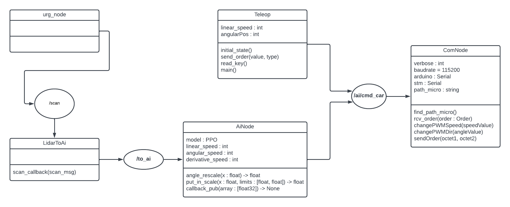

# Projet Gate CoVaps : Autotech ou la non-course de voiture autonome

Dans le cadre du projet Gate proposé par Télécom SudParis pour les premières années, nous avons dû réalisé cette année les codes pour le fonctionnement du voiture éléctrique contrôler par une IA entraînée.

## Architecture ROS

Pour la communication entre les différents éléments de la voiture tel que le contrôleur du moteur, le lidar, ... Une architecture ROS a été batie.

Je vous conseil donc de vous référer au code de chacun afin de comprendre leur fonctionnement.

## Fonctionnement global

Lorsqu'un lidar émet les données analysés, le noeud **urg_node** les renvoies sous forme de tableau de distance détecter par le lidar tout autour de la voiture. Ensuite **AiNode** séléctionne parmis ces distances celles qui sont intérressantes et les publies pour le noeud **AiNode** celui-ci adapte ces données recues pour préduire grâce au model entraîné une action, une commande de vélocité qui est communiqué à **ComNode**. Ce dernier noeud publiera au bas niveau les commandes de vitesses.

De plus un noeud **Teleop** permet le pilotage de la voiture par ordinateur.
